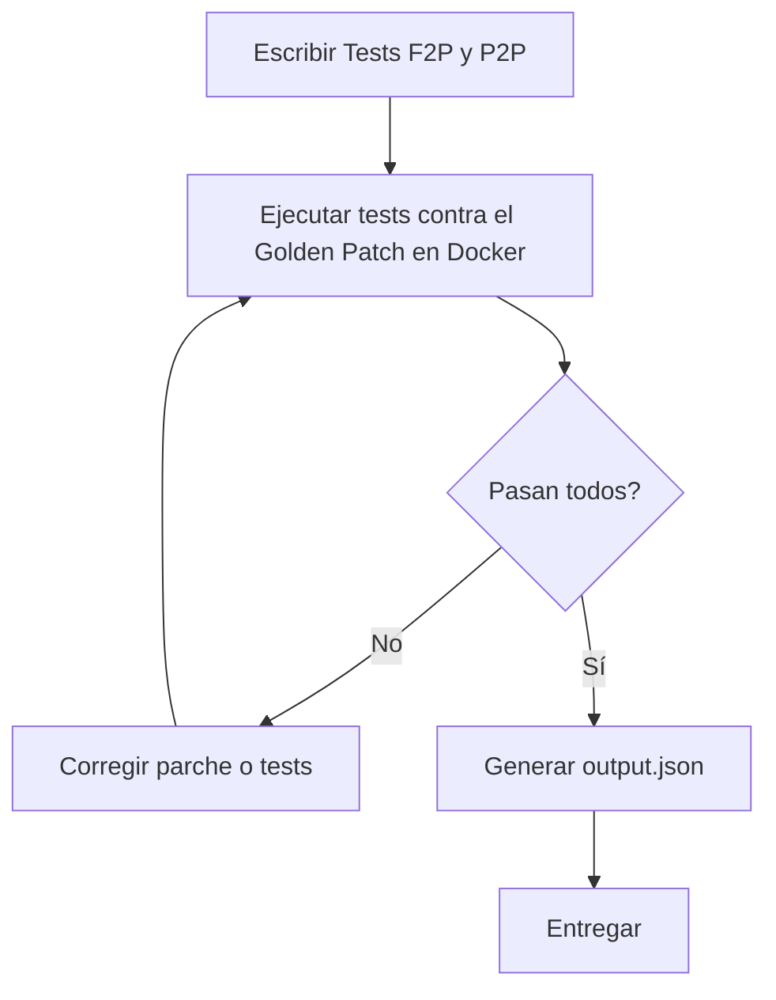

# Guía G3: Protocolo de Tests y Golden Loop — Something Big

## Tipos de Protocolo de Tests:

| Protocolo | Acrónimo | Propósito | Comportamiento Esperado |
|---|---|---|---|
| **Pass-to-Pass** | P2P | Tests de regresión | El código del Estado 1 (antes del parche) DEBE pasar estos |
| **Fail-to-Pass** | F2P | Tests funcionales | DEBEN fallar en Estado 1, DEBEN pasar en Estado 2 (después del parche) |

## El Golden Loop (Ciclo Obligatorio):

### El Ciclo en Detalle:
1.  **Paso 1: Escribir Tests:** Crear scripts de test F2P y P2P basados en el prompt de ingeniería.
2.  **Paso 2: Ejecutar Tests Against Golden Patch:** Usar `container-env-manager` para conexión SSH + Docker.
3.  **Paso 3: Iterar / Reescribir:** Si el Golden Patch NO pasa los tests F2P: reescribir el parche o los tests. Si los tests P2P fallan: corregir regresión en el test suite.
4.  **Paso 4: Entregar:** Generar `output.json` cuando todos los tests pasen.

---
*Contexto Onboarding:* 
- **Tests Agnósticos a la Implementación.**
- **Ejemplos de tests válidos:**
    *   Verificación de códigos de error específicos.
    *   Aceptación de formatos válidos (ej: IPv6 bracketed).
    *   Rechazo de caracteres inseguros o longitudes inválidas.
    *   Comportamiento ante configuraciones habilitadas/deshabilitadas.
